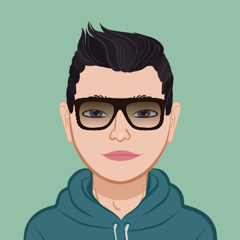

<!-- Replace with your profile image -->

  

<h1 align="center">👋 HEllo Developer ! I'm Sahil Khan</h1>

  💻 Aspiring Developer | 🌱 Passionate coder | 🚀 Tech Enthusiast

  
  
  
     

---

### 🚀 About Me

👨‍💻 "Hello, I'm Sahil Khan, a computer science student with a passion for programming and development. I specialize in frontend development and have completed certificates in C++, JavaScript, and frontend development.

With a strong foundation in programming and development, I have successfully undertaken various projects that demonstrate my skills. Two notable examples include:

🚀 Resume Builder: Developed a user-friendly web application that simplifies the process of creating professional resumes. The project involved implementing features such as template selection, dynamic content generation, and PDF export functionality.

🎥 YouTube Clone: Built a video-sharing platform inspired by YouTube, complete with user registration, video uploading, commenting, and a recommendation algorithm. The platform was designed to provide a seamless user experience, leveraging responsive design principles.

These projects have not only honed my problem-solving abilities but also improved my collaboration skills within cross-functional teams.

In addition to my project experience, I possess strong skills in C++, JavaScript, and frontend development. I enjoy staying up-to-date with the latest industry trends and technologies, and I actively seek opportunities to enhance my knowledge through continuous learning.

🌟 Here's why you should get to know me:

- 🌱 I'm constantly learning and improving my skills.
- 💡 I'm eager to collaborate on exciting projects.
- 🌈 I love to add a splash of creativity to my code.

### 🔧 Skills

🌟 
 🌟

  
  
    
  

 
  

  
  
  

### 🚀 Projects

## Here are some of my dedication and hard work :

**Project Name: Portfolio Using Three.js**

👋 I made a fantastic Portfolio Website. I used React, Three.js, and Vite to create an interactive and visually appealing site.

🎨 A Touch of Creativity: With Three.js, I added 3D elements to my website, making it stand out and look amazing. It was a fun and exciting experience to experiment with new ideas.

---

**Project Name: Disney-UI Using React+Talwind CSS (TMDB API)**

👋 Building a Disney+ UI Clone with React, Vite, Tailwind CSS, and IMDb API! 🎬

🎨 I learned web development. I got to make a Disney+ UI Clone using React, Vite, Tailwind CSS, and IMDb API to show popular movies.

---

**Project Name: Resume-Builder Using React + vite + Talwind CSS**

👋 Building a Resume-Builder with React, Vite, Tailwind CSS.

🎨 Here we make resumes single pagewith amazing templates .

---

**Project Name: Real-Time-ChatApp Using Node Js + Socket.io**

👋 I developed a Real-time Chat Application using Web Sockets.

🎨 Here we talk in a private space we can chat in groups also in real time.

Explore more of my projects in my [repositories](https://github.com/SahilKhan44).

### 📫 Contact Me

📧 Feel free to reach out to me at sahii.khan44484@gmail.com .

### 🌟 Let's Connect

I'm excited to connect with fellow developers and collaborate on innovative projects. Let's build amazing things together!

🌈 Let's make the tech world more colorful and exciting! 🚀
